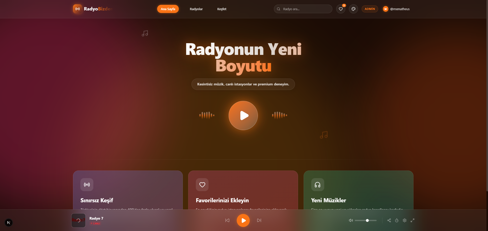

# RadyoBizden - Modern Radyo Deneyimi 📻✨

RadyoBizden, günümüzün modern web teknolojileri harmanlanarak geliştirilmiş, Türkiye'nin önde gelen canlı radyo dinleme platformudur. **Glassmorphism** tasarım diline sahip olan bu proje; pürüzsüz geçişleri, müziğe duyarlı animasyonlu arkaplanı ve zengin dinleme özellikleriyle (10-Bant Ekolayzer, Canlı Dinleyici Senkronizasyonu, Özel Radyo Yönetimi vb.) benzersiz bir kulaklık ve göz zevki sunmayı hedefler.



## 🚀 Öne Çıkan Özellikler

- **Müziği Hisset (Visualizer & EQ):** Web Audio API destekli, canlı sese tepki veren 10-bant frekans ekolayzeri (EQ) ve müziğin ritmine göre dalgalanan arkaplan baloncukları (AnimatedBackground).
- **Premium Müzik Çalar:** Yeni nesil Music Player uygulamalarından (Spotify, Apple Music) ilham alınan, pürüzsüz animasyonlu tam ekran (Fullscreen) oynatıcı ve bulanık arka plan dokusu.
- **Güçlü Veritabanı:** Supabase altyapısıyla desteklenen özel istasyon servisi. Radyo istasyonlarının clickcount, codec, bit-rate gibi özellikleri anlık kaydedilir.
- **Kullanıcı Sistemi:** Supabase Auth (E-posta / Şifre) entegre edilmiştir. Sadece kayıtlı ve giriş yapmış kullanıcılar istasyonları diledikleri gibi kişiselleştirip favorilerine kaydedebilir veya özel EQ (Presets) yapılandırmalarını bulutta tutabilir.
- **Tam Yönetim (Admin Paneli):** Özel yetkilendirilmiş "Admin" hesapları `/admin` arayüzü üzerinden platformdaki bütün istasyonları silebilir, güncelleyebilir veya Yepyeni bir `.m3u8` yayın formatı ekleyebilir.
- **Dinamik Temalar:** CSS `@property` ve Vite destekli smooth gradient geçişleri ile 5 farklı renk paletinden (RadyoBizden Özel, Okyanus, Gece Yarısı vb.) istediğinizi seçin.
- **Performans ve Hız:** Zustand global state yönetimi, PWA altyapısı ve gelişmiş ön bellek (cache) yapılandırması sayesinde sıfır bekleme süresi!

## 💻 Kullanılan Teknolojiler

- **Frontend:** React 18, Next.js (App Router), TypeScript, Tailwind CSS
- **Animasyon & UI:** Framer Motion, Lucide React, Glassmorphism CSS Forms
- **Backend & Veritabanı:** Next.js Route Handlers, Supabase (PostgreSQL), Supabase Auth
- **Audio Engine:** Web Audio API, Howler.js (Özel HLS/Stream Router fallback)
- **Veri Sağlayıcı:** RadioBrowser API (Yedek besleme), Özel Supabase Stations Modülü

## 🔧 Kurulum ve Çalıştırma

Geliştirme ortamınızı hızlıca hazırlamak için aşağıdaki adımları sırasıyla izleyin:

1. **Repoyu Klonlayın**
   ```bash
   git clone https://github.com/mxmatheus/radyobizden.git
   cd radyobizden
   ```

2. **Bağımlılıkları Yükleyin**
   ```bash
   npm install
   ```

3. **Çevre Değişkenlerini Ayarlayın**
   Projenin kök dizininde `.env.local` dosyası oluşturun ve Supabase bilgilerinizi ekleyin:
   ```env
   NEXT_PUBLIC_SUPABASE_URL=https://<your-project-url>.supabase.co
   NEXT_PUBLIC_SUPABASE_ANON_KEY=<your-anon-key>
   ```

4. **Veritabanı Kurulumu**
   `supabase-schema.sql` dosyasındaki SQL komutlarını Supabase panelinizdeki SQL Editor'de çalıştırarak tabloları ve RLS (Row Level Security) kurallarını oluşturun.

5. **Geliştirme Sunucusunu Başlatın**
   ```bash
   npm run dev
   ```
   *Uygulama `http://localhost:3000` adresinde çalışmaya başlayacaktır.*

## 📈 Radyo Göçü (Migration) Nasıl Yapılır?
Proje ilk kurulduğunda veritabanı boş olacaktır. Bütün Türkiye radyolarını sisteme kendi DB'niz üzerinden dahil etmek için:
1. Herhangi bir hesapla siteye kayıt olun.
2. Supabase SQL Editor üzerinden id'nizi bulup `role` değerinizi `admin` yapın. (Ya da doğrudan schema dosyasındaki `update public.profiles set role = 'admin' where id = 'SİZİN_İD'` kodunu kullanın).
3. Sitede profil menüsünden "Admin" sayfasına gidin.
4. **"Radyoları İçe Aktar"** butonuna basıp Radio-Browser'daki 500+ aktif Türk radyosunu saniyeler içinde kendi sisteminize entegre edin!

---
*mxmatheus tarafından müzik severler için ❤️ ile oluşturuldu.*
